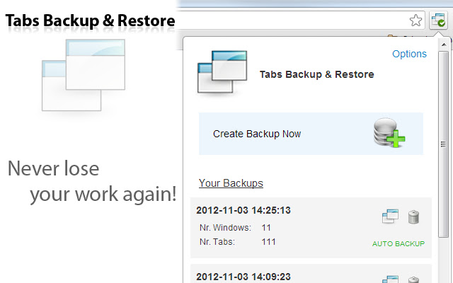
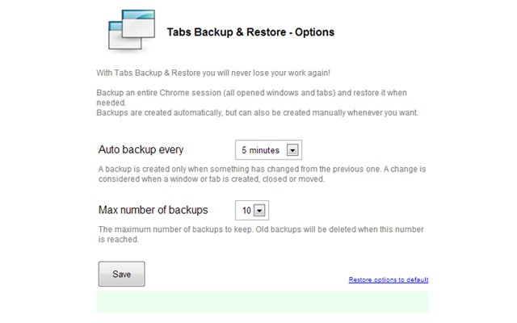

### [Tabs Backup &amp; Restore - Extended](https://github.com/warren-bank/crx-tabs-backup-restore)

Chrome extension that extends the functionality of the original [Tabs Backup &amp; Restore](https://chrome.google.com/webstore/detail/tabs-backup-restore/dehocbglhkaogiljpihicakmlockmlgd).

#### New Features:

* ability to disable saving automatic backups
  - on options page
    * when choosing the time interval
* ability to delete all backups at once
  - on advanced restore page
    * by clicking the  icon
* ability to give each backup a name
  - by clicking on the current name
  - named backups aren't automatically deleted
    * for example:
      - when an automatic backup causes the total number of backups to exceed the maximum to keep, which triggers garbage collection
    * conceptually:
      - unnamed backups are stored in a FIFO queue, having a finite length
      - named backups are not
* ability to export backups to a text file in JSON format
  - on advanced restore page
    * by clicking the  icon
  - options:
    * all backups
    * only named backups
* ability to import backups from a text file in JSON format
  - on advanced restore page
    * by clicking the  icon
  - merge operation
    * new backups are added
    * old backups are retained:
      - updated, when a new backup shares the same ID
      - unmodified, otherwise
* full support for incognito mode
  - backup data includes the mode of each window (ie: regular vs. incognito)
  - restore:
    * full windows:
      - restore to the original mode
    * selected tabs:
      - restore to multiple windows:
        * each window having a subset of its tabs selected will restore to its original mode
      - restore to a single window:
        * if __all__ selected tabs are cherry-picked from one or more incognito windows:
          - restore all selected tabs to a single new incognito window
        * otherwise:
          - restore all selected tabs to a single new regular window
* all restored tabs will lazy load
  - this is a performance optimization
    * prevents all restored tabs from loading at the same time
      - causing a short-term spike in CPU usage
      - causing a long-term spike in RAM usage
    * each tab consumes (nearly) no resources until the first time it is selected by the user
      - at which time the webpage in the tab will load

#### Screenshots:

